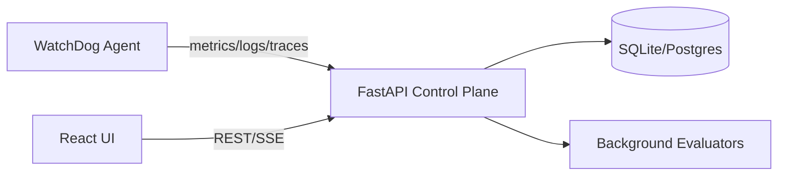

# WatchDog — Local Observability + Incident Control Plane

A fully local, production-shaped observability platform with metrics, logs, traces, monitors, SLOs, incidents, and synthetic checks.

## 60-second quickstart

```bash
make bootstrap
cp .env.example .env
cp configs/agent.yaml.example configs/agent.yaml
cp apps/web/.env.example apps/web/.env
make dev
```

In another terminal:

```bash
make demo
```

Visit `http://localhost:3000` for the UI and `http://localhost:8000/docs` for the API.

## Architecture



## What a Datadog manager cares about
- **Monitors**: threshold-based alerts on metrics/logs.
- **SLOs**: burn-rate summaries over multi-day windows.
- **Incidents**: operational timeline with human context.
- **Synthetic checks**: automated uptime validation.
- **Ingestion**: dogstatsd-like telemetry for metrics/logs/traces.

## API authentication
All endpoints require `X-API-Key`. Use the dev default from `.env.example`.

## Commands
- `make bootstrap` — installs Python + Node deps.
- `make dev` — runs API + UI.
- `make demo` — seeds demo data + telemetry.
- `make verify` — runs test + lint/build checks.

## Screenshots
- TODO: Run the app and capture screenshots.
