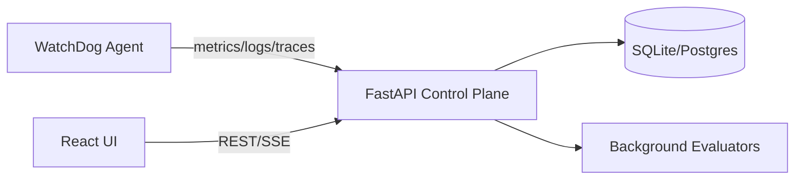

# WatchDog Architecture

## Components
- **apps/api**: FastAPI backend handling ingest, query, monitors, alerts, SLOs, incidents, synthetics.
- **apps/agent**: CLI emitting demo telemetry and running synthetic checks.
- **apps/web**: React + Vite UI for observability workflows.

## Data Flow
1. Agent sends telemetry to the ingest endpoints.
2. API persists telemetry and broadcasts logs to SSE consumers.
3. Background loops evaluate monitors and run synthetic checks.
4. UI fetches summaries and detail pages via REST APIs.
